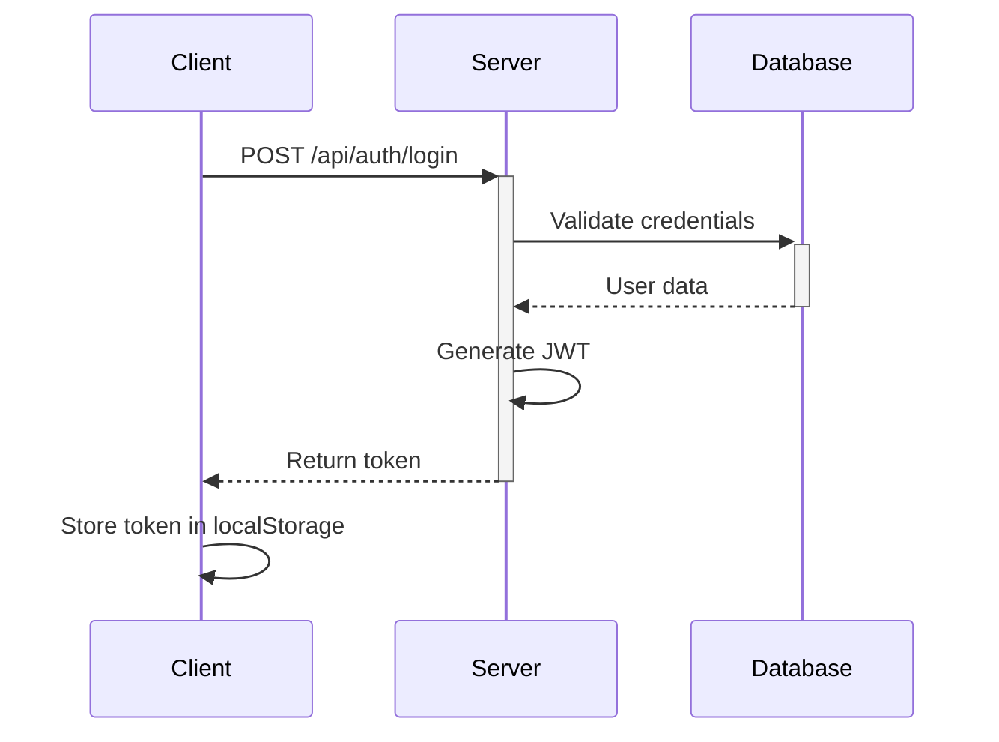
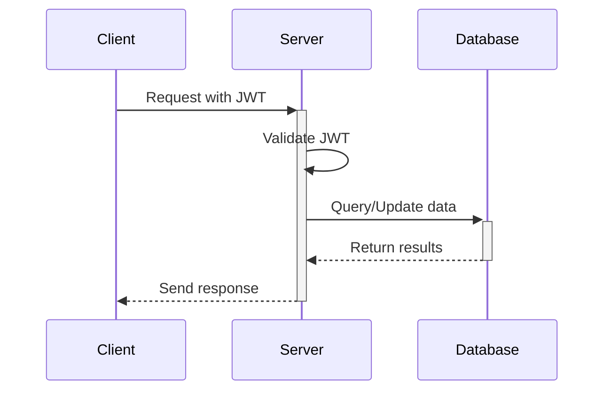

# Expense Tracker - Architecture and Flow Documentation

## System Architecture

### 1. High-Level Architecture

```
┌─────────────────┐     ┌──────────────┐     ┌─────────────┐
│   React Client  │ ←→  │  Node.js API │ ←→  │   MongoDB   │
│   (Frontend)    │     │  (Backend)   │     │ (Database)  │
└─────────────────┘     └──────────────┘     └─────────────┘
```

### 2. Component Architecture

#### Frontend Architecture

```
├── src/
│   ├── components/        # Reusable UI components
│   │   ├── Layout.js     # Main layout wrapper
│   │   ├── ProtectedRoute.js # Auth route protection
│   │   └── ExpenseTrends.js # Data visualization
│   ├── context/          # Global state management
│   │   ├── AuthContext.js    # Authentication state
│   │   └── ExpenseContext.js # Expense data state
│   ├── pages/           # Main application views
│   │   ├── Dashboard.js     # Main dashboard
│   │   ├── Expenses.js      # Expense management
│   │   └── Login.js         # Authentication
│   └── utils/           # Helper functions
```

#### Backend Architecture

```
├── src/
│   ├── controllers/     # Business logic
│   │   ├── auth.ts     # Authentication logic
│   │   └── expense.ts  # Expense management logic
│   ├── models/         # Database schemas
│   │   ├── User.ts     # User model
│   │   └── Expense.ts  # Expense model
│   ├── routes/         # API endpoints
│   │   ├── auth.ts     # Auth routes
│   │   └── expense.ts  # Expense routes
│   └── middleware/     # Custom middleware
```

## Application Flow

### 1. Authentication Flow



### 2. Expense Management Flow



## Key Components and Their Responsibilities

### 1. Frontend Components

#### Dashboard Component

- Displays overview of expenses
- Shows visualizations (pie charts, trends)
- Manages real-time updates of expense data

#### ExpenseTrends Component

- Handles data visualization
- Provides filtering options (weekly/monthly/yearly)
- Manages chart interactions

#### Context Providers

- AuthContext: Manages authentication state
- ExpenseContext: Handles expense data state and operations

### 2. Backend Services

#### Authentication Service

- User registration and login
- JWT token generation and validation
- Password encryption using bcrypt

#### Expense Service

- CRUD operations for expenses
- Data aggregation for analytics
- Input validation and sanitization

## Data Flow

### 1. Adding an Expense

```
1. User fills expense form
2. Client validates input
3. Request sent to POST /api/expenses
4. Server validates request
5. Data saved to MongoDB
6. Response sent to client
7. UI updates automatically
```

### 2. Fetching Dashboard Data

```
1. Dashboard component mounts
2. ExpenseContext fetches data
3. Server aggregates expense data
4. Data transformed for visualization
5. Charts and stats render
```

## Security Implementation

### 1. Authentication

- JWT-based token system
- Token expiration and refresh mechanism
- Protected route middleware

### 2. Data Security

- Password hashing with bcrypt
- Input sanitization
- CORS configuration
- Rate limiting

## State Management

### 1. Global State (Context API)

- Authentication state
- Expense data
- User preferences

### 2. Local State

- Form data
- UI states
- Temporary data

## Error Handling

### 1. Frontend

- Form validation
- API error handling
- Friendly error messages
- Loading states

### 2. Backend

- Request validation
- Error middleware
- Structured error responses
- Database error handling

## Performance Optimizations

### 1. Frontend

- React.memo for expensive components
- Lazy loading of routes
- Optimized re-renders
- Debounced API calls

### 2. Backend

- Database indexing
- Query optimization
- Response caching
- Pagination

## Deployment Architecture

### Production Setup

```
┌─────────────────┐     ┌──────────────┐     ┌─────────────┐
│    Netlify      │ ←→  │    Heroku    │ ←→  │  MongoDB    │
│  (Frontend)     │     │  (Backend)   │     │   Atlas     │
└─────────────────┘     └──────────────┘     └─────────────┘
```

## Future Scalability Considerations

1. Microservices Architecture

   - Separate authentication service
   - Dedicated analytics service
   - Message queue for async operations

2. Performance Enhancements

   - Redis caching
   - CDN integration
   - Server-side rendering

3. Additional Features
   - Real-time notifications
   - Export/Import functionality
   - Advanced analytics
